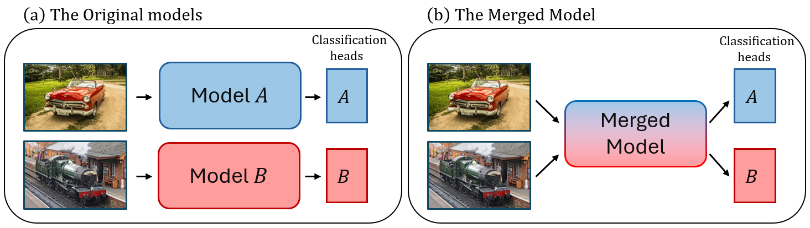
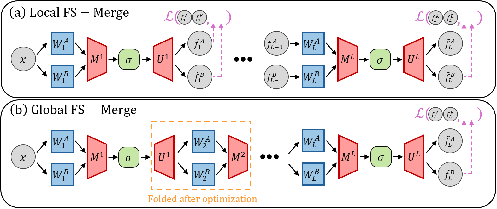

<h1 align="center"> Foldable SuperNets: Scalable Merging of Transformers with Different Initializations and Tasks </h1> 

<p align="center">
    <a href="https://www.linkedin.com/in/edan-kinderman-1320611b8/"> Edan Kinderman </a> •
    <a href="https://www.linkedin.com/in/itay-hubara-57739b29/?originalSubdomain=il"> Itay Hubara </a> •
    <a href="https://haggaim.github.io/"> Haggai Maron </a> •
    <a href="https://soudry.github.io/"> Daniel Soudry </a>
</p>

Official implementation for [Foldable SuperNets: Scalable Merging of Transformers with Different Initializations and Tasks](https://arxiv.org/abs/2410.01483).

<p align="center">

</p>

## Abstract
Many recent methods aim to merge neural networks (NNs) with identical architectures trained on different tasks to obtain a single multi-task model. Most existing works tackle the simpler setup of merging NNs initialized from a common pre-trained network, where simple heuristics like weight averaging work well. This work targets a more challenging goal: merging large transformers trained on different tasks from distinct initializations. First, we demonstrate that traditional merging methods fail catastrophically in this setup. To overcome this challenge, we propose Foldable SuperNet Merge (FS-Merge), a method that optimizes a SuperNet to fuse the original models using a feature reconstruction loss. FS-Merge is simple, data-efficient, and capable of merging models of varying widths. We test FS-Merge against existing methods, including knowledge distillation, on MLPs and transformers across various settings, sizes, tasks, and modalities. FS-Merge consistently outperformed them, achieving SOTA results, particularly in limited data scenarios.

<p align="center">

</p>

## Installation
Start by cloning this repository:

```bash
git clone https://github.com/idankinderman/fs_merge.git
cd fs_merge
```

Then create the conda environment using the yml file:

```bash
conda env create -f environment.yml
```

## Usage

### 1. Load the data and the models
To begin, load the datasets, the classification heads and the models you want to merge. Update the `data_location` variable in the code with the relevant path.
The fine-tuned ViT-B-16 models referenced in our paper can be found here (link coming soon).
Alternatively, you can fine-tune your own models using the provided [src/finetune.py](src/finetune.py) script, which is based on [task vectors](https://github.com/mlfoundations/task_vectors) [[*]](#ref1) work.
You need to organize your files with a parent directory containing both the classification heads and the models. Inside this parent directory, create a folder named `heads` for storing the classification heads and another folder named `checkpoints` for storing the models.

### 2. Extract layers
Run the following command to extract and save the layers of the models you plan to merge.

```bash
python extract.py --extract_type layers --model_type ViT-B-16 --path_to_models <PATH>
```


### 3. Extract features
Use this command to extract and save the features from the models. These features will be used in the merging process.
To extract inner features required for methods like RegMean, set `extract_type = 'all'`.
The parameter `num_features_per_dataset` defines the number of images to be taken from each training dataset.
The `aug_factor` multiplies this number by applying data augmentations, effectively increasing the number of images used.

```bash
python extract.py --extract_type none --model_type ViT-B-16 --path_to_models <PATH> --num_features_per_dataset <NUM> --aug_factor <AUG> --datasets_for_features <DATA1> <DATA2>
```

### 4. Merge
Here is an example of merging a pair of models using FS-Merge with a low rank of `12`, `100` training images per dataset, and `100` augmented images per dataset.
If you want to calculate the joint accuracy of the merged model, set `with_multi_head_eval=True`. To save the merged model, set `with_save=True`.
Examples of how to use other merge methods can be found in the [src/main.py](src/main.py) file.

```python
from merges.fs_merge import FSMerge

datasets_to_eval = ['Cars', 'CIFAR10']
models_to_merge = [f"finetuned_{data}" for data in datasets_to_eval]

fs_merge = FSMerge(
        model_type='ViT-B-16',
        experiment_name='FS_Merge_rank_12',
        experiment_dir='results',
        path_for_models=<PATH>,
        models_to_merge=models_to_merge,
        datasets_to_eval=datasets_to_eval,
        num_features_train=100,
        num_features_aug_train=100,
        descriptor="Using FS-Merge to merge models",
        epochs=100,
        batch_size=128,
        lr=0.0001,
        wd=0.001,
        scheduler_type='warmup',
        MU_init_method='first',
        MU_type='diagonal_and_low_rank',
        rank=12)

fs_merge.merge(with_eval=True, with_save=False, with_multi_head_eval=True)
```

## Citation

If you use FS-Merge or this codebase in your work, please cite:
```
@article{kinderman2024foldable,
  title={Foldable SuperNets: Scalable Merging of Transformers with Different Initializations and Tasks},
  author={Kinderman, Edan and Hubara, Itay and Maron, Haggai and Soudry, Daniel},
  journal={arXiv preprint arXiv:2410.01483},
  year={2024}
}
```

## References and credits
* <a id="ref1">[[*]](https://arxiv.org/abs/2212.04089)</a> "Editing Models with Task Arithmetic", Ilharco, Gabriel and Ribeiro, Marco Tulio and Wortsman, Mitchell and Gururangan, Suchin and Schmidt, Ludwig and Hajishirzi, Hannaneh and Farhadi, Ali. The International Conference on Learning Representations, 2023.
